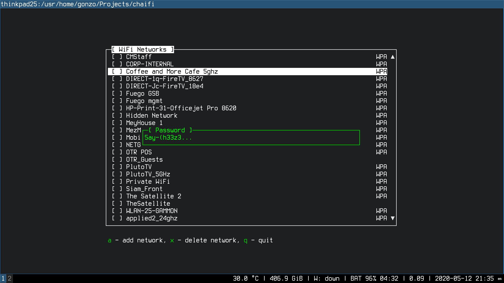

# Chai-Fi

## Description

Tool to make adding public WiFi networks to wpa_supplicant.conf easier.

## Quick start

```
sudo pkg install go
go get github.com/gonzoua/chaifi
sudo ~/go/bin/chaifi  # or add $HOME/go/bin to your PATH
```
Note: Currently works without `sudo` if you make `/etc/wpa_supplicant.conf` editable by your user.

## Build

```
go get
go build
```

## Usage
```
Usage of chaifi:
  -f string
    	path to wpa_supplicant.conf (default "/etc/wpa_supplicant.conf")
  -i string
    	wireless interface (default "wlan0")
```

## Screenshot


